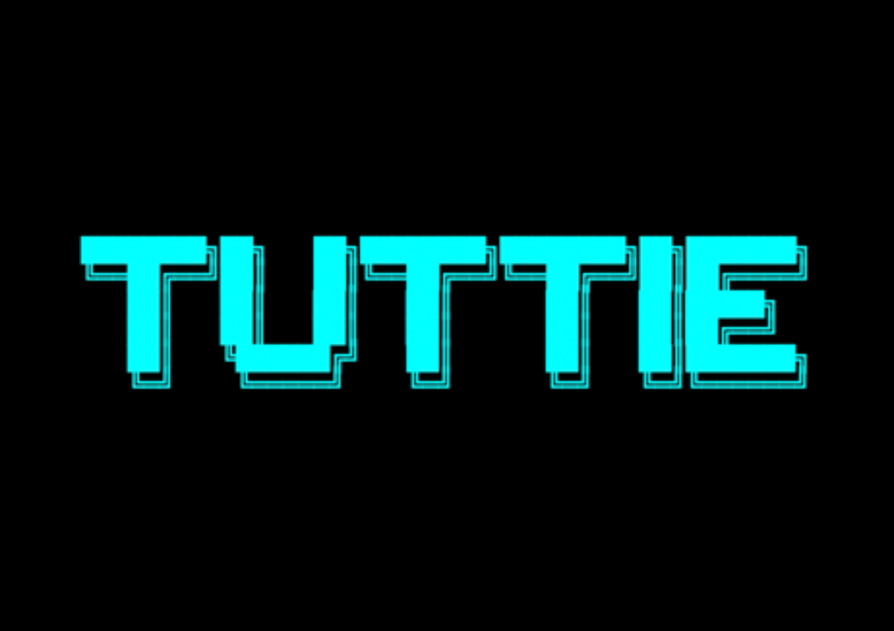

# Turtle_Race

 A fun and interactive Turtle Race game built using Python’s turtle module. It features animated particle backgrounds, an ASCII-art intro screen, click-to-start gameplay, colourful racing turtles, and a simple betting system. Players choose a turtle, watch the race, and see if their prediction wins

## Overview

The Turtle Race Game simulates a race between six turtles, each assigned a distinct color. Players are prompted to select the turtle they believe will win. During gameplay, turtles move forward with randomized steps, making each race unpredictable and engaging.

## The Game Features:
Animated Background

Custom particle animation creates a visually appealing environment. • Interactive Intro Screen
ASCII-styled splash screen with a start prompt. • User Prediction System
Players choose a turtle color before the race begins. • Randomized Movement Logic
Each turtle moves differently on every run, ensuring unique race outcomes. • Winner Announcement
Displays results at the end of each race with a clean UI message.

## Technologies Used :

Python 3.x
Turtle Module
Random Module No third-party packages are required

## Getting Started:
Ensure Python 3.8+ is installed:
```bash
python --version
```

Running the game:
```bash
git clone https://github.com/joshmanisankar-droid/Turtle_Race.git 
cd turtle-race-game
python turtle_race.py
```

Project Structure:
```text
turtle_race.py #Main Game Script
README.md#Documnetation
LICENSE#Documentation
```

## Roadmap / Future Developement :
This project is actively evolving. Planned enhancements include: • Kid-Friendly Improvements • Simplified UI and brighter aesthetics • Countdown animation before race start • Celebration effects and reward screens • Turtle expressions (happy, sad, excited) • Optional sound effects • Gameplay Expansions • Multiple race modes • Tournament-style racing • Difficulty levels • Custom turtle skins

## Contributing :
Contributions, issues, and feature requests are welcome. Feel free to open an issue or submit a pull request to contribute to the project.

